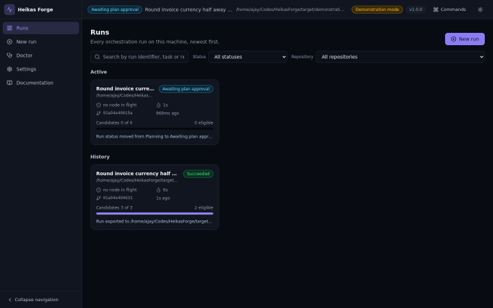
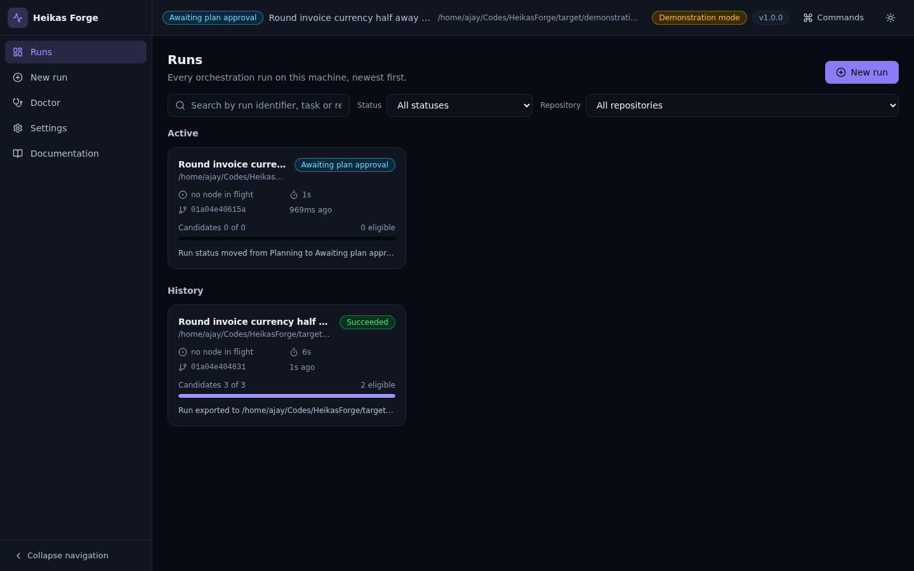
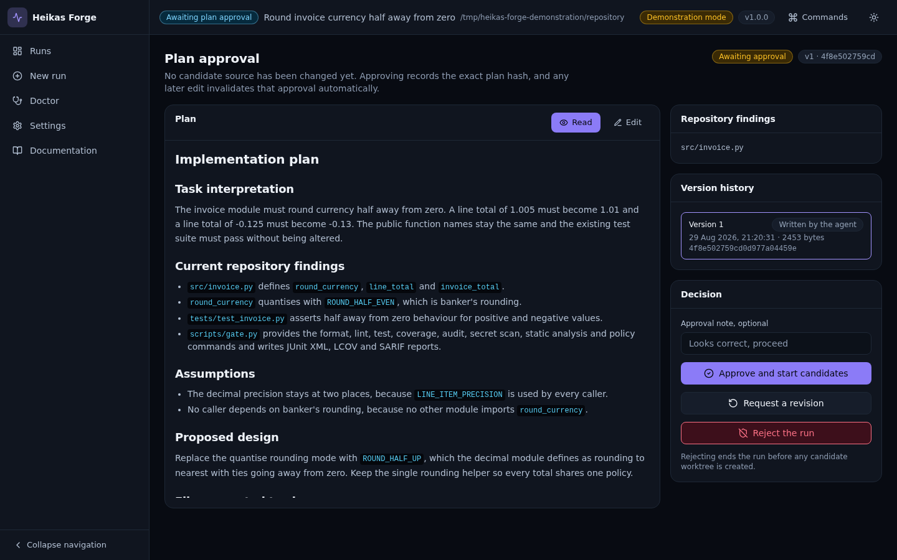
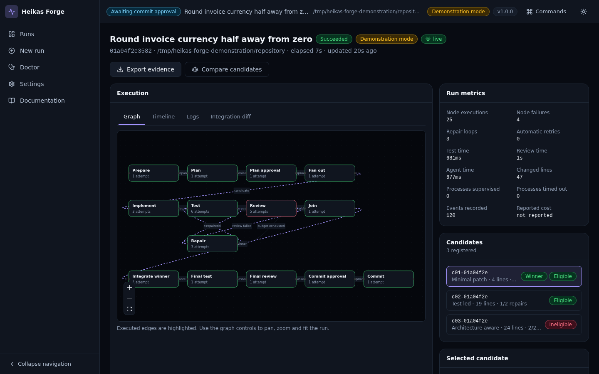
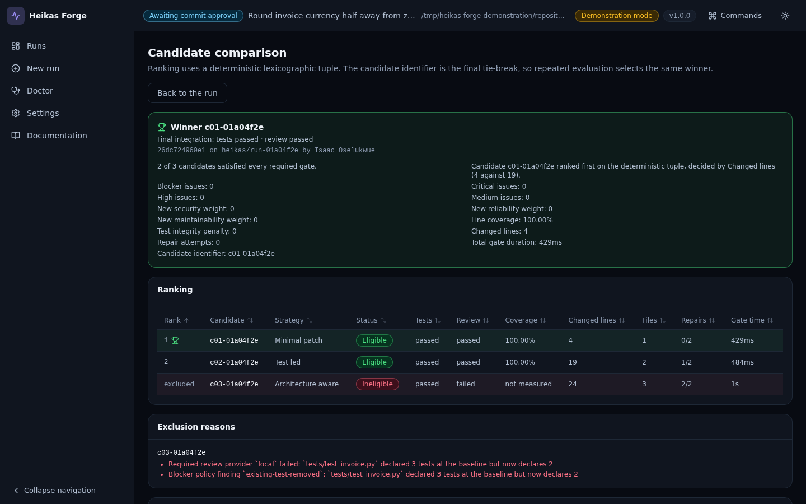
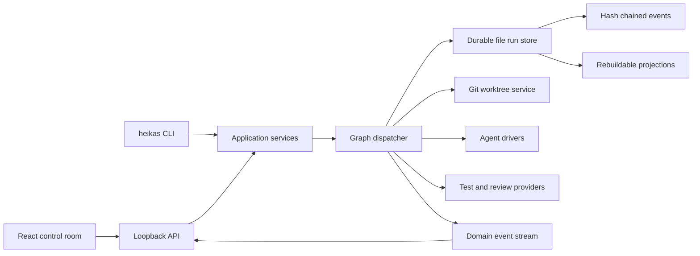

# Heikas Forge

A local-first control plane for reliable agentic software engineering.

Heikas Forge takes a coding task, writes a reviewable plan, waits for your approval, then runs several isolated implementation candidates in parallel. Every candidate is judged by deterministic tests and quality gates that an agent cannot overrule. Failures route through a bounded repair loop, the strongest valid candidate is selected by a reproducible score, and the result is re-verified in a clean integration worktree before a single commit is created on a dedicated branch.

Nothing leaves your machine. There is no required paid API, hosted database or telemetry.



Full demonstration video: [WebM](docs/media/demo.webm) and [MP4](docs/media/demo.mp4).

## Screenshots

| Dashboard | Plan approval |
| --- | --- |
|  |  |

| Run detail | Candidate comparison |
| --- | --- |
|  |  |

Every image and both videos are captured from the running application on the deterministic fixture. None is a mock-up.

## What it does

- **Plans before it touches anything.** The planning node has read-only tools. It cannot edit a file, create a branch or run an arbitrary command.
- **Waits for you.** The run pauses at `awaiting_plan_approval` indefinitely and survives a restart. Approval records the exact BLAKE3 hash of the plan you approved, and any later edit invalidates it automatically.
- **Isolates every candidate.** Each candidate gets its own Git worktree from the same immutable baseline, its own process tree and its own repair budget.
- **Trusts evidence, not claims.** Completion is derived from Git diffs, process exit statuses and parsed reports. An agent summary is supporting evidence only.
- **Repairs within a budget.** A failing test or quality gate routes into a bounded repair loop. Repeated identical failures exhaust the budget early instead of looping.
- **Selects reproducibly.** Eligible candidates are ranked by a lexicographic tuple ending in the candidate identifier, so the same evidence always selects the same winner. Every exclusion is recorded with its reason.
- **Re-verifies before committing.** The winning patch is applied to a clean integration worktree and every required gate runs again. Candidate results are never reused as final evidence.
- **Commits safely.** A dedicated `heikas/run-<short-id>` branch receives the commit. Your default branch is never modified and nothing is ever pushed.
- **Recovers exactly.** `events.jsonl` is a hash-chained, sequence-numbered log. Projections are rebuildable caches. A forced process exit is a tested operating condition.

## Architecture



The domain layer holds the state machines, event model, scoring policy and path rules, and depends on no filesystem, process, HTTP, Git or interface code. The application layer coordinates it through ports. Infrastructure implements those ports. The CLI and the loopback API are delivery adapters over the same application services.

Architecture records live in [`docs/architecture/`](docs/architecture/).

## Quick start

Requirements: Rust 1.98, Node.js 22, pnpm, Git and Python 3 for the bundled fixture. `ffmpeg` is needed only if you regenerate the documentation video.

```bash
git clone https://github.com/isaacoselukwue/HeikasForge.git
cd HeikasForge
pnpm install
pnpm --dir apps/web build
cargo build --release -p heikas-cli

# Check that the environment is ready
./target/release/heikas doctor /path/to/your/repository

# Create the repository configuration
./target/release/heikas init /path/to/your/repository

# Start the control room
./target/release/heikas ui
```

`heikas ui` prints a loopback address with a one-time bootstrap token in the URL fragment. Open it and the interface exchanges the token for a session cookie.

### Try it without configuring anything

The deterministic fixture runs the complete flow with no model, no account and no network:

```bash
cargo run -p xtask -- demo
```

It seeds a small Python repository with a real rounding defect, runs three candidates, produces one failed test gate, one successful repair, one candidate excluded for weakening an existing test, two eligible candidates, a deterministic winner and a commit on a dedicated branch.

## Command line

```bash
heikas doctor /path/to/repository            # inspect Git, agents, commands, scanners and disk
heikas init /path/to/repository              # detect the project and write .heikas/forge.toml
heikas trust /path/to/repository             # accept the executables a cloned repository declares
heikas run --repo . --task "Fix the rounding defect in the invoice total"
heikas list                                  # every run with status, node, age and winner
heikas show <run-id>                         # summary, candidate table and selection rationale
heikas approve-plan <run-id>                 # approve the exact plan hash
heikas revise-plan <run-id> --note "..."     # request a new plan version
heikas approve-commit <run-id>               # permit the final commit
heikas timeline <run-id> --format html       # render the executed transitions
heikas logs <run-id> --follow                # stream redacted structured logs
heikas export <run-id> --output ./evidence   # redacted evidence archive
heikas cancel <run-id>                       # cancel and terminate every child process
heikas cleanup <run-id> --force              # remove worktrees, keep the evidence
```

Exit codes are stable: `0` success, `2` invalid usage, `3` awaiting approval, `4` exhausted, `5` failed, `6` cancelled, `7` recovery required, `8` policy violation, `130` interrupted.

Add `--json` to any command for a single machine-readable object.

## Safety and privacy

- The interface binds to `127.0.0.1` and is not remotely reachable without an explicit development flag.
- Each server start issues a random bootstrap token, exchanged for an HTTP-only same-site session cookie. State-changing requests require a cross-site token and a matching origin, and are rate limited.
- The interface loads no remote fonts, analytics or content delivery networks, and declares a strict content security policy with no inline scripts.
- Agents receive no general shell. Only named commands from your configuration can be run, as an executable plus an argument vector. Task text is never interpolated into a shell.
- Every agent path is confined to its assigned worktree, and is checked against protected and sensitive glob rules. Symbolic links out of the worktree are refused.
- Agents cannot commit, push, fetch, merge, rebase, alter remotes, change Git configuration or update submodules. All Git writes belong to the infrastructure Git service.
- Child processes run in their own process group on Unix and a Job Object on Windows, with timeouts, output limits and escalation. No descendant survives a timeout or cancellation.
- A repository's own `.heikas/forge.toml` is treated as untrusted input. Settings that name an executable are honoured only after you run `heikas trust`, and that decision is bound to the exact file digest, so editing the file withdraws it. Settings that would redirect your model endpoint, your API key variable, your Sonar host or your commit authorship are never honoured from a repository. Safety settings such as protected paths and redaction can only be tightened by a repository, never relaxed. `heikas doctor` lists whatever was withheld and why.
- Secrets are redacted where records are written, so nothing unredacted reaches the durable event log, the projections, the attempt evidence, the live event stream or an export.
- An evidence archive reports what it actually did. Text entries are redacted by content, entries that are not text are counted and named as unredacted rather than labelled otherwise, and worktree files matching a sensitive pattern are excluded and listed.
- A patch from an agent is enumerated by Git itself, forwards and in reverse, so renames, copies and mode changes are policy checked like any other write. A patch that creates a symbolic link is refused.
- Existing tests, coverage thresholds and quality configuration cannot be weakened silently. Deleting a test, adding a skip marker or lowering a threshold is a blocking finding.

## Adapters

| Adapter | Purpose | Required | Needs an account |
| --- | --- | --- | --- |
| Built-in local tool agent | Bounded tool-calling loop against a local model runtime on loopback | Yes, as the default free path | No |
| Deterministic fixture agent | Replays a recorded script for demonstrations and tests | No | No |
| External coding CLI adapters | Delegate implementation to an installed coding CLI, with the strongest restrictions that the CLI actually supports | No | Depends on the CLI |
| Local quality provider | Format, lint, test, coverage, audit, secret scan, static analysis and policy commands with JUnit XML, LCOV and SARIF parsing | Yes | No |
| SonarQube scanner | Runs a self-managed SonarQube Community Build scanner and normalises the quality gate | No | No |
| SonarQube MCP | Read-only review through a SonarQube MCP server, with recorded tool evidence | No | No |
| Advisory review | Maintainability and design observations, advisory unless a configured rule promotes a finding | No | No |

An external adapter detects its real restriction strength by reading the installed interface's own option listing, rather than assuming it from the adapter name. If a required restriction option is missing, or the listing cannot be read, the adapter reports no isolation and refuses a read-only planning node rather than silently weakening it. After a read-only invocation the worktree is re-hashed, and any change fails the node. Arguments that would bypass a restriction are refused at configuration time.

## Development

```bash
cargo xtask verify        # the complete local verification suite
cargo xtask demo          # the deterministic end to end demonstration
cargo xtask media         # derive the animation and MP4 from captured frames, needs ffmpeg
cargo xtask authorship    # verify the identity on every commit
cargo xtask schemas       # regenerate the JSON schemas and the frontend wire types

cargo test --workspace
cargo clippy --workspace --all-targets -- -D warnings
cargo fmt --all -- --check
heikas policy .           # repository conformance checks

pnpm --dir apps/web test        # component and accessibility tests
pnpm --dir apps/web e2e         # browser tests against a real orchestrator
pnpm --dir apps/web capture     # regenerate the documentation media
```

Frontend transport types are generated from the Rust JSON schemas into `apps/web/src/generated/`. There are no hand-written duplicate wire models.

## Project detection

Point Heikas Forge at a repository and it proposes the commands that gate a run. Detection
surveys the tracked file listing rather than the working directory, because a candidate
worktree is checked out from the baseline commit and holds nothing that is untracked or
ignored.

| Ecosystem | Recognised by | Test command | Executed count read from |
| --- | --- | --- | --- |
| Rust | `Cargo.toml` | `cargo test --workspace --no-fail-fast` | the cargo summary line |
| Go | `go.mod` | `go test -count=1 -json ./...` | the test event stream |
| Python | `pyproject.toml`, `setup.py`, `setup.cfg`, `requirements.txt`, with a tracked test file | `python3 -m pytest -q` | the pytest summary line |
| Node | `package.json` with a test script, a recognised runner and a tracked lockfile | `<manager> run test` | the Vitest, Jest, Mocha or Node built in runner summary |
| CMake | `CMakeLists.txt`, with a tracked ignore rule for the build directory | `ctest --test-dir build --no-tests=error` | the CTest summary line |

Every proposed test command makes its executed count observable, and a required test
command that executed nothing is recorded as missing evidence rather than as a pass.
Skipped and ignored tests do not count as executed. Where a count cannot be obtained the
detector declines and says why, rather than proposing a gate that cannot be checked.

Detection proposes only bare executable names from a fixed set, and only arguments that
are compile time constants. Repository content is read for the presence of a script or a
lockfile, never for the identity of a program.

Nothing needs to be detected to use the tool. Declare a command for a single run:

```bash
heikas run --repo . --task "Fix the rounding defect" \
  --command test=pytest --command-arg test=-q \
  --command lint=ruff --command-arg lint=check --command-arg lint=.
```

Or write `[[commands]]` entries into `.heikas/forge.toml` and accept them with
`heikas trust .`.

## Contributing

Contributions are welcome. Read [CONTRIBUTING.md](CONTRIBUTING.md) for the development
setup, the verification command and the conformance rules the repository enforces, and
[CODE_OF_CONDUCT.md](CODE_OF_CONDUCT.md) for the standards expected of participants.

Please report a security problem privately through the
[security policy](SECURITY.md) rather than in a public issue.

## Status and limitations

The orchestration core, durable persistence and recovery, Git isolation, quality gates, scoring, the loopback API, the control room and the command line application are implemented and covered by the test suite.

Honest limitations:

- A local model still has to be capable enough to solve your task. Heikas Forge validates that the selected model makes reliable structured tool calls, but it cannot make a small model competent.
- The demonstration fixture replays a recorded script. It proves the orchestration, persistence, gates and selection are real. It does not prove any particular model performs well.
- Windows support is implemented through Job Objects and the full test suite runs on Windows in continuous integration, but the process-tree and Git behaviour has been exercised most heavily on Linux.
- The Go detector's event stream parser is covered by unit tests against captured output, but no Go toolchain was available where this was developed, so the Go path has not been exercised end to end.
- An executed test count is read from the test command's own output. It is a guard against a repository that has no tests, not against one that misreports, because running a project's tests runs that project's code. See [`docs/architecture/quality-providers.md`](docs/architecture/quality-providers.md).
- A repository whose build system is not in the table above, such as Bazel, Gradle, Maven or a bare Makefile, is declined with the reason and must have its command declared.
- SonarQube integration expects a self-managed instance you provide. It is never required.
- Merge conflicts during integration are not repaired by an agent. The candidate is marked non-promotable and the next ranked candidate is tried.
- There is no multi-user mode, no remote execution and no automatic pushing or pull request creation.

## Licence

MIT. See [`LICENSE`](LICENSE).

## Inspiration

The product design develops the ideas in John Crickett's Coding Challenge #134, Agentic Engineering Graph, into a complete local-first architecture.
