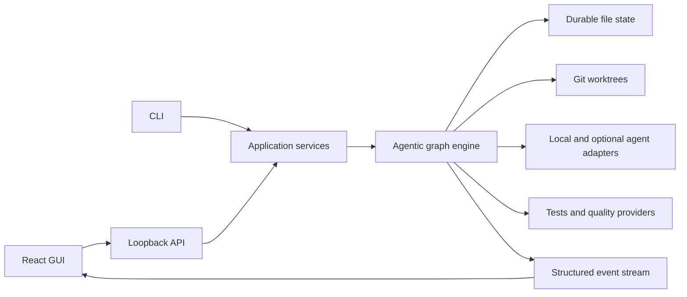

# Heikas Forge

A local-first control plane for reliable agentic software engineering.

Heikas Forge is designed to plan a coding task, pause for human approval, run isolated implementation candidates, test and review each candidate, repair failures, select the strongest valid result, and preserve a complete crash-recoverable history.

## Current status

This repository is under active implementation. The Rust orchestration core, adapters, loopback API and command line application are in place, and the graphical interface, fixtures and public media are being completed.

## Intended experience

The finished application provides:

- a polished local graphical interface and complete CLI;
- human approval before candidate code is changed;
- durable file-based state and exact crash recovery;
- concurrent candidates isolated by Git worktrees;
- deterministic tests, quality gates and winner selection;
- bounded repair loops;
- final integration checks and safe commits;
- structured logs, graph visualisation and a complete timeline;
- a free local agent path with optional hosted adapters;
- no required paid API, hosted database or hosted telemetry.

## Architecture

The Rust domain and application layers remain independent of the GUI, HTTP, Git, process and model implementations. Human-readable run files remain the durable contract.

## Screenshots and demonstration

Media captured from the running application on the deterministic fixture will appear here.

- `docs/media/demo.gif`
- `docs/media/demo.webm`
- `docs/media/demo.mp4`
- `docs/media/dashboard.png`
- `docs/media/plan-approval.png`
- `docs/media/run-detail.png`
- `docs/media/candidate-comparison.png`

## Inspiration

The product specification is based on the ideas in John Crickett's Coding Challenge #134, Agentic Engineering Graph, and develops them into a complete local-first product architecture.

## Licence

MIT
